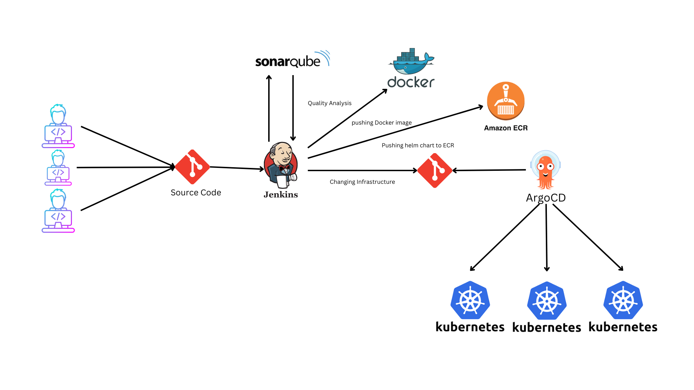

# JenkinsCI and ArgoCD
- This automating deployment of a node.js webapplication  in Kubernetes cluster using jenkins and ArgoCD after we can watch it using Istio 

## Requirements

- k8s cluster
- Python 🐍
- kubectl

# Work flow

####  For setup Argocd and deployment please check the readme.txt in setup folder 

## Feedback

If you have any feedback, please reach out to us at m.pajmalaju07@gmail.com
